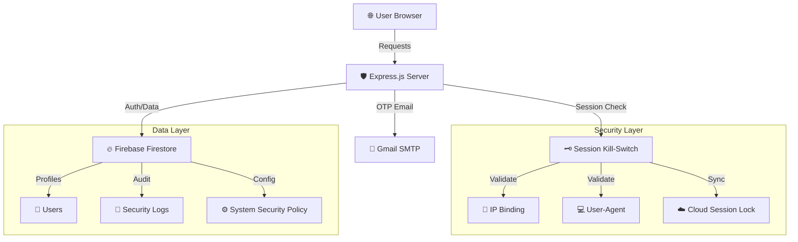

# Project Description: Session Kill-Switch & Secure Banking System

## 1. Executive Summary
The **Session Kill-Switch & Secure Banking System** is a high-security financial platform designed to demonstrate and implement advanced defensive mechanisms against modern web threats. Built with a "Zero-Trust" philosophy, the application focuses on protecting user sessions at the transport and application layers. It features a proprietary "Session Kill-Switch" that instantly terminates unauthorized access attempts based on real-time telemetry, including IP binding, hardware fingerprinting, and concurrent login prevention.

The project serves a dual purpose:
1.  **Production-Ready Banking**: Providing core financial services such as fund transfers, deposits, and account freezing.
2.  **Security Research & Demonstration**: A dedicated "Control Panel" allows security researchers to toggle individual defense layers (like CSRF, SQLi/XSS sanitization, and session flags) to observe how vulnerabilities manifest when protections are removed.

---

## 2. Technical Stack

### **Backend (Server-Side)**
*   **Node.js & Express.js**: The core engine handling routing, middleware, and API logic.
*   **Firebase Admin SDK**: Used for cloud-persistent storage of user profiles, transaction logs, and real-time security configurations.
*   **Nodemailer**: Integrated with SMTP services for delivering secure 6-digit One-Time Passwords (OTP) to registered emails.
*   **Bcrypt**: Implementing industry-standard salted hashing for password storage.

### **Security Layer (Defense-in-Depth)**
*   **Helmet.js**: Configures secure HTTP headers, including a strict Content Security Policy (CSP), XSS Protection, and Referrer Policy.
*   **Csurf**: Provides robust protection against Cross-Site Request Forgery (CSRF) by requiring unique tokens for state-changing requests.
*   **GeoIP-Lite**: Performs real-time geolocation lookups on incoming requests to flag suspicious login locations.
*   **Express-Rate-Limit**: Prevents brute-force attacks by throttling requests to sensitive endpoints (Login, Transfer, Profile Update).
*   **Cookie-Parser**: Manages secure session cookies with configurable `httpOnly` and `SameSite` flags.

### **Frontend & UI/UX**
*   **Vanilla HTML5 & Semantic Web Elements**: Used for structure and SEO optimization.
*   **Vanilla CSS3 (Glassmorphism)**: A futuristic, premium aesthetic featuring blurred backgrounds, vibrant gradients, and responsive layouts.
*   **Vanilla JavaScript (ES6+)**: Handles real-time telemetry polling, UI animations, and secure API communication.
*   **Interactive Mini-Animations**: Micro-interactions provide a "living" interface feel, enhancing engagement during the security demonstration.

---

## 3. Core Features & Functional Modules

### **A. Advanced Session Management (The Kill-Switch)**
The centerpiece of the application is the **Session Kill-Switch**. Unlike standard session management, this system binds a user's session ID to a specific "Trust Profile":
*   **IP Binding**: The session is immediately invalidated if the request originates from a different IP address than the one used at login.
*   **UA Fingerprinting**: Detects changes in the browser's User-Agent string to prevent session theft via browser hijacking.
*   **Concurrent Session Blocking**: Uses Firebase to maintain a "Single Source of Truth" for active sessions, automatically revoking old sessions when a new verified login occurs.
*   **Cloud-Sync Rehydration**: If the local server restarts, sessions are "rehydrated" from Firebase, ensuring no user is logged out unexpectedly, while maintaining full security validation.

### **B. Two-Step Authentication (OTP)**
A mandatory 2FA layer requires users to provide a 6-digit code sent via email. This process is fully integrated with a "pending session" state, ensuring that session cookies are only issued after successful verification.

### **C. Secure Banking Operations**
*   **Atomic Transfers**: Validates balances and captures transaction metadata (IP, Location, Timestamp) for every movement of funds.
*   **Instant Account Freeze**: Allows users to "self-destruct" the functionality of their account (blocking all outgoing transfers/deposits) in case of suspected compromise.
*   **Transaction Telemetry**: Every account action is logged with geolocation data, providing a forensic trail for security auditing.

### **D. Interactive Security Control Panel**
Designed for demonstration, this panel allows users to turn security features ON or OFF:
*   **HTTP-Only Toggle**: Observe how an attacker can steal a session cookie via `document.cookie` when this flag is disabled.
*   **Input Sanitization Toggle**: Switch between safe and vulnerable modes to test XSS (Cross-Site Scripting) payloads.
*   **CSRF Protection Toggle**: Demonstrate forged transactions by disabling token verification.
*   **Live Attack Logs**: A terminal-style interface displays real-time defensive logs, showing the system "thinking" and blocking threats.

---

## 4. Security Philosophy: "Defend by Design"
The project follows the "Defensive Paradigm," treating every request as potentially hostile. 

1.  **Sanitize by Default**: All inputs are stripped of script tags unless explicitly configured otherwise for demo purposes.
2.  **Strict Origin Control**: The application only communicates with verified endpoints, and the CSP blocks unauthorized script execution.
3.  **Active Threat Logging**: Instead of silent failures, the system generates "Hijack Alerts" if a mismatch is detected, notifying the user via email and the dashboard interface instantly.

---

## 6. System Architecture & Data Flow
The following diagram illustrates the interaction between the client, the Node.js server, and the Firebase persistence layer.

---

## 7. API Reference (Core Endpoints)

| Endpoint | Method | Security Level | Purpose |
| :--- | :--- | :--- | :--- |
| `/login/step1` | POST | Rate Limited | Initial password verification and OTP generation. |
| `/login/step2` | POST | MFA Required | Verification of 6-digit email OTP. |
| `/api/transfer` | POST | CSRF + Session Bound | Atomic fund transfer between accounts. |
| `/api/freeze` | POST | Session Bound | Instant account lock-down. |
| `/api/security-mode/toggle` | POST | Admin/Demo | Live toggling of defensive layers. |
| `/api/logs` | GET | Session Bound | Real-time security telemetry feed. |

---

## 8. Detailed Security Workflows

### **The "Amnesia-Proof" Session Rehydration**
One common failure in cloud applications is the loss of active sessions during a server restart or deployment. Our system implements a **Cloud Rehydration Hook**:
1.  The client sends a request with an existing session cookie.
2.  If the server memory is empty (due to restart), the `secureMiddleware` queries Firebase Firestore using the `sessionID`.
3.  If a matching "Cloud Session Lock" is found, the session is restored into server memory with its original IP and User-Agent fingerprint.
4.  The request proceeds without the user ever being forced to log out, maintaining a seamless but secure experience.

### **Anatomy of a Blocked Hijack Attempt**
When a threat actor steals a cookie and attempts access from a different machine:
1.  **Telemetric Mismatch**: The server detects that `currentIP` does not match `req.session.clientIP`.
2.  **Immediate Severing**: The middleware immediately triggers the Kill-Switch.
3.  **Cloud Invalidation**: The session is deleted from Firebase and server memory.
4.  **Audit & Notification**: A high-severity `HIJACK_BLOCKED` event is logged, and the legitimate user receives an automated email notification about the unauthorized attempt.

---

## 9. Future Roadmap & Scalability
While the current system is optimized for research and SME banking demonstration, it is designed to scale:
*   **Biometric Integration**: Extending the OTP system to support WebAuthn (TouchID/FaceID).
*   **Machine Learning Heuristics**: Implementing behavior-based threat detection to identify anomalous activity patterns beyond static IP binding.
*   **Global Node Clustering**: Utilizing Firebase's global distribution to ensure uniform security policy application across geographically diverse edge nodes.
